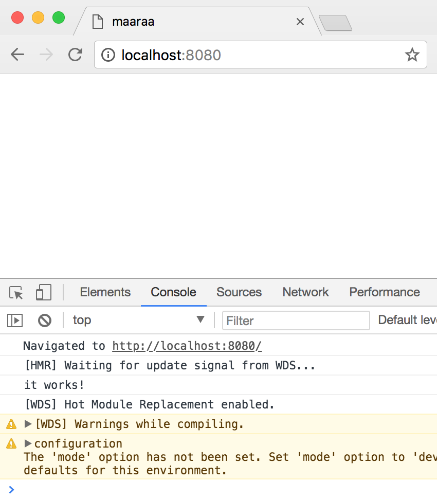

## What we need as pre-requisites?

1. Node Package Manager npm to manage all the required javascript packages.

2. `nodejs` to implement our development server. npm will get install when you install nodejs.
> [Download Node.js](https://nodejs.org/en/ "Download Node.js")

### Once you have Node
Yes, thats what we all need along with working internet connection to get your project start and go with following steps. 

#### npm init
Create your project folder and init the npm to create `package.json` file. This file will have the details of your project that you enter while init and further dependency packages that you will install.
```bash
$ npm init
This utility will walk you through creating a package.json file.
It only covers the most common items, and tries to guess sensible defaults.

See `npm help json` for definitive documentation on these fields
and exactly what they do.

Use `npm install <pkg>` afterwards to install a package and
save it as a dependency in the package.json file.

Press ^C at any time to quit.
package name: (react-basic-setup)
version: (1.0.0)
description: A basic react project setup to start with. If you are looking for one, clone it and use it.
entry point: (index.js)
test command:
git repository:
keywords:
author: maaraa
license: (ISC) MIT
About to write to /Users/gk/GK/GURU/Studies/ReactJS/react-basic-setup/package.json:

{
  "name": "react-basic-setup",
  "version": "1.0.0",
  "description": "A basic react project setup to start with. If you are looking for one, clone it and use it.",
  "main": "index.js",
  "scripts": {
    "test": "echo \"Error: no test specified\" && exit 1"
  },
  "author": "maaraa",
  "license": "MIT"
}


Is this ok? (yes) yes
```

---

## Production Dependencies
#### `react` core library
You need to have react package that you install using npm and you need it as a production dependency for this project to work after deployment as well during development.
```bash
$ npm install --save react
npm WARN react-basic-setup@1.0.0 No repository field.

+ react@16.2.0
added 17 packages in 2.741s
```

#### `react-dom` library
You need `react-dom` as a production dependency which takes care of co-ordination with DOM elements and virtual DOM.
```bash
$ npm install --save react-dom
npm WARN react-basic-setup@1.0.0 No repository field.

+ react-dom@16.2.0
added 1 package in 0.897s
```

---

## Developement Dependencies
#### `webpack`
Webpack for bundling your code. We will bundle all the files into single file using this. Also, you will load the different loaders for code compilation and transpilation (eg. babel)
```bash
$ npm install --save-dev webpack
npm WARN react-basic-setup@1.0.0 No repository field.

+ webpack@4.1.0
updated 1 package in 8.459s
```
#### `webpack-cli`
The CLI of webpack has been moved to a separate package `webpack-cli` and hence that needs to be installed in addition to `webpack`
```bash
$ npm install --save-dev webpack-cli
npm WARN deprecated nomnom@1.8.1: Package no longer supported. Contact support@npmjs.com for more info.

> spawn-sync@1.0.15 postinstall ~/react-basic-setup/node_modules/spawn-sync
> node postinstall

npm WARN react-basic-setup@1.0.0 No repository field.

+ webpack-cli@2.0.10
added 294 packages in 18.177s
```
#### `webpack-dev-server`
Webpack have this package to use it as your development web server.
```bash
$ npm install --save-dev webpack-dev-server
npm WARN react-basic-setup@1.0.0 No repository field.

+ webpack-dev-server@3.1.0
added 262 packages in 10.203s
```

#### `babel-core`
This is to transpile your ES6 code to ES5 since most of the browsers supports ES5 mostly. 
```bash
$ npm install --save-dev babel-core
npm WARN react-basic-setup@1.0.0 No repository field.

+ babel-core@6.26.0
added 32 packages in 5.235s
```
#### `babel-loader` 
This loader will be configured in webpack and webpack will use this.
```bash
$ npm install --save-dev babel-loader
npm WARN react-basic-setup@1.0.0 No repository field.

+ babel-loader@7.1.4
updated 1 package in 4.452s
```
#### Babel Presets 
This to tell babel which logics that transpiler needs. We need below presets

Preset|Description
---|---
`babel-preset-es2015`|this is to tell babel to use es6 to es5 logic
`babel-preset-react`|this is to tell babel that this code is based on react library which it needs to transpile
`babel-preset-stage-2`| this is for having some extra features. [More information on stages](https://tc39.github.io/process-document/)

```bash
$ npm install --save-dev babel-preset-es2015 babel-preset-react babel-preset-stage-2
npm WARN deprecated babel-preset-es2015@6.24.1: 🙌  Thanks for using Babel: we recommend using babel-preset-env now: please read babeljs.io/env to update!
npm WARN react-basic-setup@1.0.0 No repository field.

+ babel-preset-stage-2@6.24.1
+ babel-preset-react@6.24.1
+ babel-preset-es2015@6.24.1
added 71 packages in 7.143s
```
---

## Application Creation
1. We will have a `src` folder which will hold all of source files

2. `app` folder inside it that holds our reactjs app.

3. `src/index.html` that is our root file & entry point of our application webpage.

4. `webpack.config.js` to configure webpack to do the bundling.

    `webpack.config.js` configuration - a little overview
```javascript
//It needs webpack
var webpack = require('webpack');
//Importing path - a global javascript library to resolve the application's absolute path
var path = require('path');
//The distribution directory to push the transpiled and bundled files. This is the directory from which you will server your app.
var DIST_DIR = path.resolve(__dirname, 'dist');
//The Source folder to intimate webpack where to find the original source codes
var SRC_DIR = path.resolve(__dirname, 'src');
//The webpack configuration which is actually an javascript object.
var config = {
  //The entry file where the webpack needs to start with and understand the dependencies
  entry: SRC_DIR + '/app/index.js',
  //The output configuration where to output the file
  output: {
    path: DIST_DIR + '/app',
    filename: 'bundle.js',
    publicPath: '/app/'
  },
  //Define the modules that needs to be used during the webpack process of bundling
  module: {
    //loaders are renamed to rules in webpack v 4.1.0. rules are array of objects to use during webpack process (eg. babel-loader for transpiling es6 to es5)
    rules: [
      {
        //test tells webpack which files to look at
        test: /\.js?/,
        //include key to tell webpack which folders to be scanned the test files
        include: SRC_DIR,
        //which loader to use
        loader: 'babel-loader',
        //query key is a JS Object that tells presets to work
        query: {
          //presets are array
          presets: ['react', 'es2015', 'stage-2']
        }
      }
    ]
  }
}
//export the config as module
module.exports = config;
```


5. `app/index.js` file which will act as an entry point on the webpack configuration

6. Include the bundled script file in `index.html` within body using
```html
`<script src='/app/bundle.js'></script>`
```

7. Scripts to be excuted which will start the webpack build process or start the developement server. This needs to created in `package.json`

**build** script
```json
"build": "webpack -d && cp src/index.html dist/index.html && webpack-dev-server --content-base src/ --inline --hot"
```

> `webpack -d` : to start the build process in development mode

> `cp src/index.html dist/index.html"` : to copy the index.html to dist folder

> `webpack-dev-server --content-base src/ --inline --hot"`
>  1. `webpack-dev-server` : to start the webpack-dev-server  
>  2. `--content-base src/` : to set the base content folder during development mode
>  3. `--inline` : to start the server in inline mode
>  4. `--hot` : to do hot reload

**build:prod** script
```json
"build:prod": "webpack -p && cp src/index.html dist/index.html"
```

> `webpack -d` : to start the build process in production mode. It will do somethings like minifying
> `cp src/index.html dist/index.html"` : to copy the index.html to dist folder

**start** script
```json
"start": "npm run build"
```
> `npm run build` will just run the build script

So finally the scripts looks like this,
```json
{
  "scripts": {
    "start": "npm run build",
    "build": "webpack -d && cp src/index.html dist/index.html && webpack-dev-server --content-base src/ --inline --hot",
    "build:prod": "webpack -p && cp src/index.html dist/index.html"
  }
}
```

**Run `npm start` to initiate the development webserver**
```bash
$ npm start

> react-basic-setup@1.0.0 start ~/react-basic-setup
> npm run build


> react-basic-setup@1.0.0 build ~/react-basic-setup
> webpack -d && cp src/index.html dist/index.html && webpack-dev-server --content-base /src --inline --hot

Hash: e2f93d66a4bf18efa441
Version: webpack 4.1.0
Time: 358ms
Built at: 2018-3-7 16:31:54
    Asset      Size  Chunks             Chunk Names
bundle.js  3.22 KiB    main  [emitted]  main
Entrypoint main = bundle.js
[./src/app/index.js] 40 bytes {main} [built]
(node:4394) DeprecationWarning: Tapable.plugin is deprecated. Use new API on `.hooks` instead
ℹ ｢wds｣: Project is running at http://localhost:8080/
ℹ ｢wds｣: webpack output is served from /app/
ℹ ｢wds｣: Content not from webpack is served from /src
⚠ ｢wdm｣: Hash: 7a8f40117756d593aa27
Version: webpack 4.1.0
Time: 11693ms
Built at: 2018-3-7 16:31:56
    Asset     Size  Chunks             Chunk Names
bundle.js  147 KiB       0  [emitted]  main
Entrypoint main = bundle.js
   [0] (webpack)/hot/log.js 1.03 KiB {0} [built]
   [1] (webpack)/hot/emitter.js 77 bytes {0} [built]
   [4] ./src/app/index.js 40 bytes {0} [built]
   [5] (webpack)/hot/log-apply-result.js 1.31 KiB {0} [built]
   [6] (webpack)/hot/dev-server.js 1.66 KiB {0} [built]
   [8] (webpack)/hot sync nonrecursive ^\.\/log$ 170 bytes {0} [built]
  [12] ./node_modules/ansi-html/index.js 4.16 KiB {0} [built]
  [13] (webpack)-dev-server/client/overlay.js 3.58 KiB {0} [built]
  [14] ./node_modules/sockjs-client/dist/sockjs.js 176 KiB {0} [built]
  [15] (webpack)-dev-server/client/socket.js 1.05 KiB {0} [built]
  [16] ./node_modules/loglevel/lib/loglevel.js 7.68 KiB {0} [built]
  [18] ./node_modules/strip-ansi/index.js 161 bytes {0} [built]
  [25] ./node_modules/url/url.js 22.8 KiB {0} [built]
  [26] (webpack)-dev-server/client?http://localhost:8080 7.75 KiB {0} [built]
  [27] multi (webpack)-dev-server/client?http://localhost:8080 webpack/hot/dev-server ./src/app/index.js 52 bytes {0} [built]
    + 13 hidden modules

WARNING in configuration
The 'mode' option has not been set. Set 'mode' option to 'development' or 'production' to enable defaults for thisenvironment.
ℹ ｢wdm｣: Compiled with warnings.
```

**Working Screenshot**

